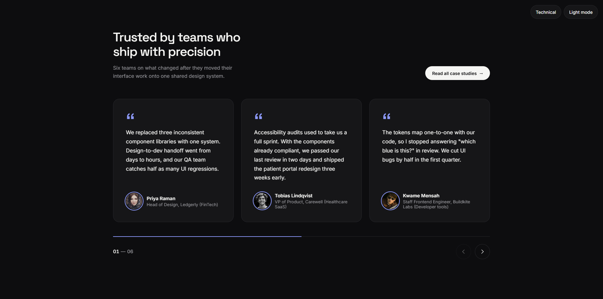

# Elegant Testimonials Slider — Dark Mode, Multi-Font & Accent Theming.

[](https://github.com/Darshittank/Testimonial-Cards/stargazers)
[](https://github.com/Darshittank/Testimonial-Cards/network)
[](https://github.com/Darshittank/Testimonial-Cards/issues)
[](https://opensource.org/licenses/MIT)
[](https://darshittank.github.io/Testimonial-Cards)

## 🎯 Live Demo
👉 **[View Elegant Testimonials Cards Now!](https://darshittank.github.io/Testimonial-Cards)** 👈

## 🗺️ Roadmap.sh Solution
👉 **[View My Elegant Testimonials Cards](https://roadmap.sh/projects/accordion/solutions?u=6a54aaccace5f057736e8164)** 👈

## 📌 Project Page
👉 **[Testimonials Cards Project](https://roadmap.sh/projects/testimonial-cards)** 👈

## 📖 **About Elegant Testimonials Slider — Dark Mode, Multi-Font & Accent Theming**

A production-ready testimonial carousel built with Slick Slider, featuring a refined editorial aesthetic inspired by Linear, Vercel, and Stripe.

### 🎯 **Key Features**

- 🧩 Elegant serif headline with tight letter-spacing and muted subhead
- 🧩 6 realistic, metric-driven B2B SaaS testimonials with diverse portraits
- 🧩 Light / Dark mode toggle with system preference detection & localStorage persistence (no FOUC)
- 🧩 Multi-font style switcher — Editorial (serif), Modern (Inter), Technical (Space Grotesk)
- 🧩 Live accent color theming wired through buttons, quote marks, and progress bar
- 🧩 Segmented progress indicator + numbered slide counter (01 — 06)
- 🧩 Auto-advance with pause-on-hover, keyboard arrow navigation, and touch swipe
- 🧩 Accessible: aria-live region, aria-pressed toggles, focus-visible rings, prefers-reduced-motion support
- 🧩 Responsive: 3 cards desktop → 2 tablet → 1 mobile with 44px tap targets

## 📸 Preview



📦 Use Cases
- Websites & blogs
- Admin dashboards
- Creative UI designs

🛠 Tech
- Vanilla HTML + CSS + jQuery + Slick Carousel. No build step.

🚀 Getting Started
- Paste into your project
- Customize styles as needed

🎨 Design
Warm off-white / deep charcoal palette, 20px card radius, subtle hover lift, cubic-bezier(0.4, 0, 0.2, 1) easing throughout.

🎯 Goal
- To provide developers and designers with scalable, modern, and efficient Tooltip solutions that save time and improve user experience. Perfect as a drop-in section for SaaS landing pages, portfolio sites, or design-system showcases.

🤝 Contributing
- Contributions are welcome! Feel free to submit new patterns, improvements, or bug fixes.

  

## 🙌 Author

**Darshit**

⭐ Show Your Support

If you like this project, please give it a ⭐ on GitHub! It helps others discover it too.

Made with ❤️ and lots of Testimonials Cards!

## 🚀 **Installation**

### Local Development

```bash
# Elegant Testimonials Slider

## Live Demo
https://darshittank.github.io/Testimonials-Cards/

## Repository
https://darshittank.github.io/Testimonials-Cards/

## Roadmap.sh Project
https://darshittank.github.io/Testimonials-Cards/
